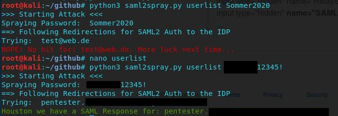

# SAML2Spray
Python Script for SAML2 Authentication Passwordspraying
  
In a recent pentest I came accross the need to passwordspray a SAML2 authentication.
As I couldn't find a ready to go solution, nor was able to do it with burp, I created my own little script to do the job for me.

  

**TL/DR;**  

The script needs some tweaking to fit you current situation:  
- The URL for the service you want to access  
- The URL for the Identity Provider which the Service Provider will redirect you to  
- The values names that the Identity Provider is expecting when authenticating  
(everything can be read from the following explainations)  

When ready run it with:  
>python3 saml2spray.py "path/to/userfile" "password"  

Following you'll find a short explaination of the workflow of a SAML2 authentication, which is:
- User want's to access a service on site A
- site A redirects to the identity provider on site B
- User authenticates to site B which gives a SAML-Response and redirects the user authenticated to site A, granting access to the desired service
  
** The long story - step by step**  

Here I will go into a little detail on how the actual process looks like and what you need to take notes and care of.  

In order for the script to run, we need to fetch some things beforehand. Burp or alike can come in handy here.
  
Initial request to the Service Provider at **mysite.service**:
  
>GET / HTTP/1.1  
>Host: **mysite.service**  
>User-Agent: Mozilla/5.0 (X11; Linux x86_64; rv:60.0) Gecko/20100101 Firefox/60.0  
>...
  
The response is a redirect to the Identity Provider at **idp.mysite** which will handle the authentication process
  
>HTTP/1.1 302 Found  
>date: Thu, 03 Sep 2020 08:27:36 GMT  
>server: Apache  
>expires: Wed, 01 Jan 1997 12:00:00 GMT  
>cache-control: private,no-store,no-cache,max-age=0  
>location: **https://idp.mysite/idp/profile/SAML2/Redirect/SSO?SAMLRequest=hZJdb4IwFIb...**
  
and if followed will look something like so - which is the actual SAML request:
  
>GET /idp/profile/SAML2/Redirect/SSO?**SAMLRequest=hZJdb4IwFI...**&RelayState=ss%3Am...&SigAlg=http%3A%2F%2Fwww.w3.org%2F2001%2F04%2Fxmldsig-more%23rsa-sha512&Signature=pBLfAUYBuNM... HTTP/1.1  
>User-Agent: Mozilla/5.0 (X11; Linux x86_64; rv:60.0) Gecko/20100101 Firefox/60.0  
>Accept: text/html,application/xhtml+xml,application/xml;q=0.9,*/*;q=0.8  
>Accept-Language: en-US,en;q=0.5  
>...  
>**Host: idp.mysite**  
  
Now we have to authenticate to the IDP with a username and password. This also is the point where you want to fetch the correct names to provide for username and  
password and maybe certain other parameters that have to be provided in order for the login to succeed. In this case we have:  
**j_username  
j_password  
_eventId_proceed**
  
>**POST /idp/profile/SAML2/Redirect/SSO?execution=e1s1 HTTP/1.1  
>Host: idp.mysite**  
>User-Agent: Mozilla/5.0 (X11; Linux x86_64; rv:60.0) Gecko/20100101 Firefox/60.0  
>Accept: text/html,application/xhtml+xml,application/xml;q=0.9,*/*;q=0.8  
>Accept-Language: en-US,en;q=0.5  
>Accept-Encoding: gzip, deflate  
>**Referer: https://idp.mysite/idp/profile/SAML2/Redirect/SSO?execution=e1s1**  
>Content-Type: application/x-www-form-urlencoded  
>Content-Length: 59  
>Cookie: JSESSIONID=ABCDEFGHIJKLMNOP123456789  
>Connection: close  
>Upgrade-Insecure-Requests: 1  
>  
>**j_username=test%40test.de&j_password=test&_eventId_proceed=**  
  
If we provided wrong credentials we will most likely be redirected to a page for "wrong username/password".  
But if we provided correct creds, we will get a SAML response which will then redirect us to the service we initially requested.  
NOTE: In this scenario Shibboleth was used, but it should work with any SAML2 IDP.  
  
>HTTP/1.1 200 200  
>..  
>set-cookie: shib_idp_session=12345asdaw42qdasdasd; **Domain=idp.mysite**; Path=/; Secure; HttpOnly  
>..       
>        form action=**"https&#x3a;&#x2f;&#x2f;mysite.service&#x2f**;Shibboleth.sso&#x2f;SAML2&#x2f;POST" method="post"      
>               input type="hidden" name="RelayState" value="ss&#x3a;mem&#x3a;f42430684asd3214325qasdfaysdasd"                                    
>               input type="hidden" **name="SAMLResponse"** value="PD94bWwgdmVyc2lvbj0iMS4wIiBlbmNvZGluZz0iVVRGLTgiPz48c2Ftb  
>                ...  
